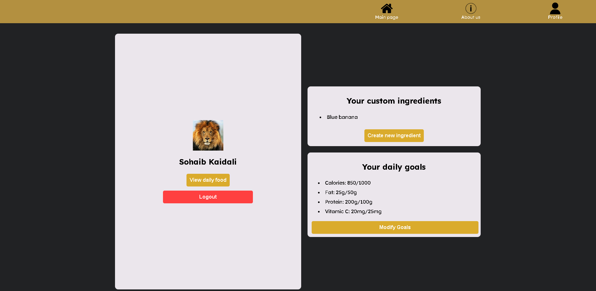

# FoodBuds: A Full-Stack Nutrition Tracker

[](https://opensource.org/licenses/MIT)
[](https://github.com/)
[](https://reactjs.org/)
[](https://nodejs.org/)
[](https://www.mongodb.com/)

A full-stack MERN application that allows users to search for foods, track their daily nutritional intake, and create custom ingredients, featuring Google OAuth for secure authentication.

[DEVPOST - DawHacks 2024 2nd place Hack/1st place Case Competition](https://devpost.com/software/nutrition-calculator-l9afq8)

---

### **Visual Demo**




---

## Table of Contents

- [FoodBuds: A Full-Stack Nutrition Tracker](#foodbuds-a-full-stack-nutrition-tracker)
    - [**Visual Demo**](#visual-demo)
  - [Table of Contents](#table-of-contents)
  - [About The Project](#about-the-project)
  - [Key Features](#key-features)
  - [Tech Stack](#tech-stack)
  - [Getting Started](#getting-started)
    - [Prerequisites](#prerequisites)
    - [Installation](#installation)
  - [Usage](#usage)
  - [Technical Challenges \& Lessons Learned](#technical-challenges--lessons-learned)
      - [1. State Synchronization Between a React Client and Express Server](#1-state-synchronization-between-a-react-client-and-express-server)
      - [2. Implementing Secure Third-Party Authentication](#2-implementing-secure-third-party-authentication)
  - [Future Improvements](#future-improvements)
  - [License](#license)

---

## About The Project

FoodBuds is a web application designed to simplify nutritional tracking. Many people struggle to maintain a balanced diet because of the difficulty in tracking the nutritional content of their daily meals. This project addresses that problem by providing an intuitive interface to search a comprehensive food database, compile meals, and instantly view detailed nutritional information presented in a familiar "Nutrition Facts" format.

Users can create a personal profile using secure Google OAuth, which allows them to save custom food items and set personal dietary goals. This full-stack application demonstrates a complete MERN architecture, from the interactive React frontend to the robust Express.js and MongoDB backend, all connected via a RESTful API.

## Key Features

*   **Comprehensive Food Database**: Search for thousands of food items seeded from a nutritional dataset.
*   **Dynamic Nutrition Calculator**: Add foods to a list and instantly see the aggregated nutritional information, including macronutrients and vitamins, with daily value percentages.
*   **Secure User Authentication**: Seamless and secure user login and registration powered by Google OAuth 2.0, with server-side session management.
*   **Personalized User Profiles**: Logged-in users can create and save their own custom food ingredients to the database, tailoring the application to their specific needs.
*   **Interactive UI**: A responsive and user-friendly interface built with React, featuring real-time search suggestions and notifications for a smooth user experience.
*   **RESTful API**: A well-structured backend API built with Express.js to handle all data operations, user authentication, and business logic.

## Tech Stack

The project is built with the MERN stack and other modern web technologies.

**Frontend:**
*   React.js
*   React Router
*   Axios
*   Google OAuth Library (`@react-oauth/google`)
*   React Toastify (for notifications)
*   CSS3

**Backend:**
*   Node.js
*   Express.js
*   Mongoose
*   Express Session
*   Google Auth Library
*   Dotenv

**Database:**
*   MongoDB Atlas

## Getting Started

To get a local copy up and running, follow these simple steps.

### Prerequisites

*   **Node.js** and **npm**: Make sure you have Node.js and npm installed. You can download them from [nodejs.org](https://nodejs.org/).
*   **MongoDB**: You need a running MongoDB instance. You can use a local installation or a cloud service like MongoDB Atlas.
*   **Google OAuth Credentials**: Create a project in the [Google Cloud Console](https://console.cloud.google.com/) and obtain an OAuth 2.0 Client ID.

### Installation

1.  **Clone the repository:**
    ```sh
    git clone https://github.com/kaidalisohaib/DawHacks24.git
    cd DawHacks24
    ```

2.  **Install Backend Dependencies:**
    ```sh
    cd server
    npm install
    ```

3.  **Install Frontend Dependencies:**
    ```sh
    cd ../client
    npm install
    ```

4.  **Set Up Environment Variables:**
    Create a `.env` file in the `server` directory and add the following variables:
    ```env
    CONNECTION_STRING="your_mongodb_connection_string"
    SECRET="your_session_secret_key"
    ```

5.  **Seed the Database (Optional but Recommended):**
    From the root project directory, run the seed script to populate the database with initial food data.
    ```sh
    npm run seed
    ```

## Usage

1.  From the root directory, run the start script, which will concurrently start the backend server and the React development server.
    ```sh
    npm run dev
    ```
2.  Open your browser and navigate to `http://localhost:3000` to see the application.

## Technical Challenges & Lessons Learned

This project provided several opportunities to solve complex full-stack engineering problems.

#### 1. State Synchronization Between a React Client and Express Server

*   **The Problem:** Managing the application's state—such as the user's list of added foods, profile data, and authentication status—across a decoupled frontend and backend required a robust communication strategy.
*   **The Solution:** I designed and implemented a RESTful API using Express.js to serve as the single source of truth. The React frontend uses `axios` for all asynchronous data fetching and manipulation. React's `useState` and `useEffect` hooks were used to manage component-level state and trigger UI re-renders in response to API data, ensuring the user always sees the most current information. For authentication, `express-session` was used on the server to maintain a persistent user session after a successful Google OAuth login.
*   **What I Learned:** This challenge solidified my understanding of REST API design principles, client-side asynchronous programming with Promises (`async/await`), and the importance of effective state management in single-page applications.

#### 2. Implementing Secure Third-Party Authentication

*   **The Problem:** Creating a secure and user-friendly authentication system without the risk and complexity of storing and managing user passwords directly.
*   **The Solution:** I integrated the Google OAuth 2.0 flow. The frontend, using `@react-oauth/google`, handles the user interaction and receives a JWT from Google. This token is then securely sent to the backend API. The server verifies the token's authenticity and integrity using the `google-auth-library`. Upon successful verification, the backend either finds the existing user or creates a new one in the MongoDB database, then establishes a secure session for subsequent requests.
*   **What I Learned:** I gained hands-on experience with the OAuth 2.0 flow, server-side token validation, and the security best practices involved in handling credentials from a third-party identity provider. This taught me how to delegate authentication securely while maintaining control over user data within my own application.

## Future Improvements

*   **Containerization**: Implement Docker and Docker Compose to containerize the frontend, backend, and database for streamlined setup and deployment.
*   **Data Visualization**: Add a dashboard on the user profile page with charts and graphs (e.g., using Chart.js) to visualize nutritional intake trends over time.
*   **Testing**: Write unit and integration tests for the backend API using Jest and Supertest to ensure reliability and catch regressions.
*   **Advanced State Management**: Refactor the frontend to use a global state management library like Redux Toolkit or Zustand to more efficiently manage complex state across components.

## License

Distributed under the MIT License. See `LICENSE` for more information.
